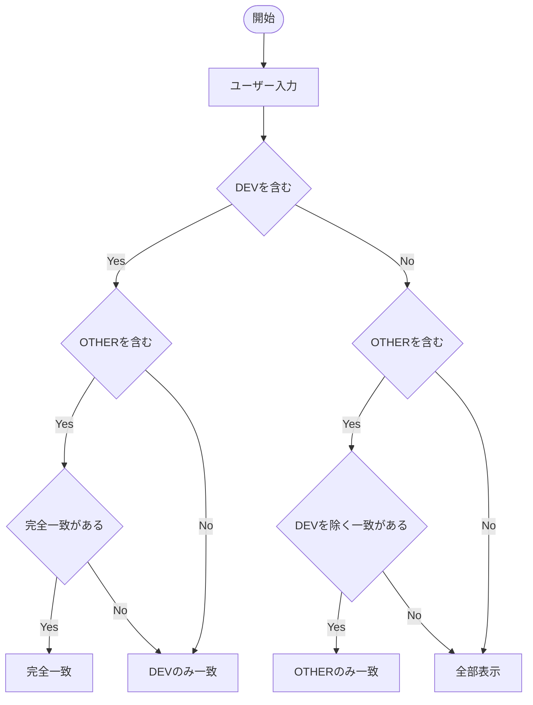

## Java21 Project

### 配列操作の方法
- 詳細は main.java に記載

- 共通して含む場合の書き方
```java
result = devCandidate.stream()
.filter(otherCandidate::contains).collect(Collectors.toList());
```

### 条件フロー

```mermaid
flowchart TD
    Start([開始]) --> Input[ユーザー入力]
    Input --> Switch1{DEVを含む}
    
    Switch1 -- Yes --> Switch2{OTHERを含む}
    Switch1 -- No --> Switch4{OTHERを含む}

    Switch2 -- Yes --> Switch3{完全一致がある}
    Switch2 -- No --> Case2[DEVのみ一致]
    
    Switch3 -- Yes --> Case1[完全一致]
    Switch3 -- No --> Case2[DEVのみ一致]

    Switch4 -- Yes --> Switch5{DEVを除く一致がある}
    Switch4 -- No --> Case4[全部表示]

    Switch5 -- Yes --> Case3[OTHERのみ一致]
    Switch5 -- No --> Case4[全部表示]
    
```